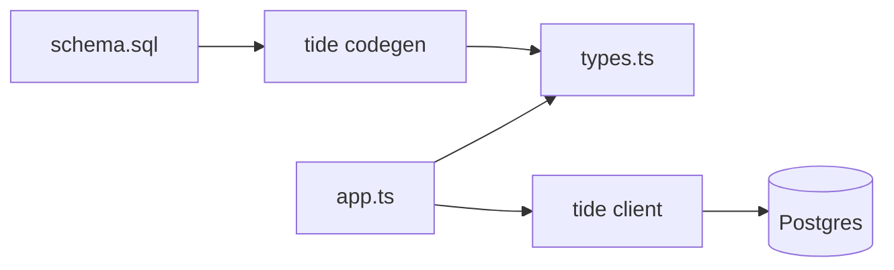

# Framework / Heavy tool archetype

For frameworks, runtimes, build tools, ORMs, design systems, and other "big surface area" projects where a reader needs concept-level understanding before they can use it. Examples in spirit: Next.js, Drizzle, esbuild, shadcn/ui, Vite, Prisma.

## When to pick this archetype

- The project has more than one core concept the reader has to understand to use it.
- Readers usually compare it against alternatives before choosing.
- There is a separate documentation site, and the README's job is to summarize and route.

If the project has only one entry point and a small API, use the Library archetype instead. Frameworks earn the architecture diagram and the comparison table; libraries don't.

## Default tone

Modern-clean, dense, confident. Sentence-case headings. Short paragraphs. No marketing prose, but fine to take a position ("we picked X over Y because Z").

Frameworks often have an established voice in their existing README and docs. If so, match it; the existing voice is almost always better tuned to the audience than a generic rewrite.

## Visual elements toolkit

Frameworks earn the most structural visuals.

- **Hero block**: logo or wordmark, one-line tagline, install or quick-start command.
- **Badge row** (centered): build, version, downloads, license, stars (only if reasonable to show), Discord.
- **One-paragraph "what is this"**: dense, factual, names the category and the differentiator.
- **Comparison table** (optional but valuable): this project vs 1 to 3 alternatives. 4 to 8 rows. Be honest; readers can spot rigged tables.
- **Architecture diagram**: mermaid is ideal because it renders on GitHub. Use a `flowchart` for component relationships, `sequenceDiagram` for request flow, or `stateDiagram-v2` for lifecycles. Keep it readable; if the diagram needs more than 12 nodes, split into two.
- **Quickstart**: 3 to 5 numbered steps, real code or commands, ending with a working "hello world."
- **Concept callouts**: if there are 3 to 5 core concepts (router, loader, action; or schema, table, query), name them with a one-line gloss. Link to the docs page for each.
- **Benchmarks** (optional): only with a link to the benchmark code. Otherwise people don't believe them.
- **Sponsors block**: only if the project has real sponsors.
- **Multiple docs links** at the bottom: docs, examples, blog, RFC tracker, Discord.

## Section structure

```md
<centered hero: logo, tagline, badges>

## What it is
<one paragraph naming the category and what makes this one different>

## Why <name>
<comparison table, or 3 short paragraphs of "vs" reasoning>

## How it works
<mermaid diagram + 1 paragraph>

## Quickstart
<3 to 5 numbered steps>

## Core concepts
- **Concept 1** (one line)
- **Concept 2** (one line)
- **Concept 3** (one line)

## Examples
<links to examples/ folder, blog posts, demo apps>

## Benchmarks
<optional, with link to script>

## Roadmap
<optional, link out>

## Community
<Discord, Discussions, Twitter, Office hours>

## License
<one line>
```

## Mini example skeleton

```md
<div align="center">


# Tide

A typed, edge-first ORM for Postgres. SQL stays SQL, types stay accurate.

[](https://www.npmjs.com/package/tide)
[](https://github.com/acme/tide/actions)
[](https://tide.dev)
[](https://discord.gg/tide)

</div>

## What it is

Tide is a Postgres ORM for TypeScript. It generates exact types from your schema and lets you write SQL in TypeScript without losing the SQL. No DSL gymnastics, no `any`, no surprise N+1s.

## Why Tide

| | Tide | Prisma | Drizzle | Knex |
| --- | --- | --- | --- | --- |
| Real SQL | yes | partial | yes | yes |
| Generated types | yes | yes | yes | no |
| Edge runtime | yes | partial | yes | partial |
| Migrations | yes | yes | yes | yes |
| ESM-only | yes | no | yes | no |

## How it works



`tide codegen` reads `schema.sql`, generates exact TypeScript types, and the runtime client uses them at every query site.

## Quickstart

1. **Install**
  ```bash
   npm install tide
  ```
2. **Define your schema**
  ```sql
   -- schema.sql
   create table users (id uuid primary key, email text not null);
  ```
3. **Generate types**
  ```bash
   npx tide codegen
  ```
4. **Query**
  ```ts
   import { tide } from "./tide";

   const users = await tide.query(sql`select * from users where email = ${email}`);
  ```

## Core concepts

- **Schema-first**: source of truth is `schema.sql`, not decorated classes.
- **Generated types**: re-run `tide codegen` after schema changes; CI fails if types drift.
- **Edge-safe runtime**: the client uses `fetch`-based drivers; works on Vercel, Cloudflare, Bun.

## Examples

See `[examples/](examples/)` for Next.js, Hono, and SvelteKit setups.

## Community

[Docs](https://tide.dev)  ·  [Discord](https://discord.gg/tide)  ·  [Discussions](https://github.com/acme/tide/discussions)

## License

MIT

```

## Anti-patterns specific to frameworks

- **A 50-row comparison table** that nobody reads. Pick the 5 to 8 rows that matter.
- **Rigged comparisons** ("Tide: yes, Prisma: no" when Prisma also supports the feature). Readers will spot it and trust drops.
- **An architecture diagram with 30 nodes**. Two simple diagrams beat one busy one.
- **The README that is the docs**. If the README is 800 lines, split it; the README routes, the docs explain.
- **No quickstart**. A framework without a 5-minute "hello world" feels intimidating regardless of how good it is.
```

